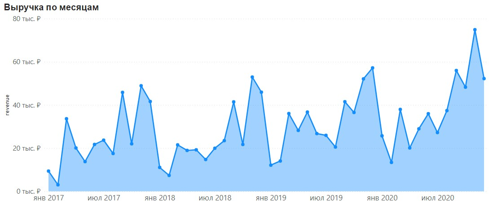
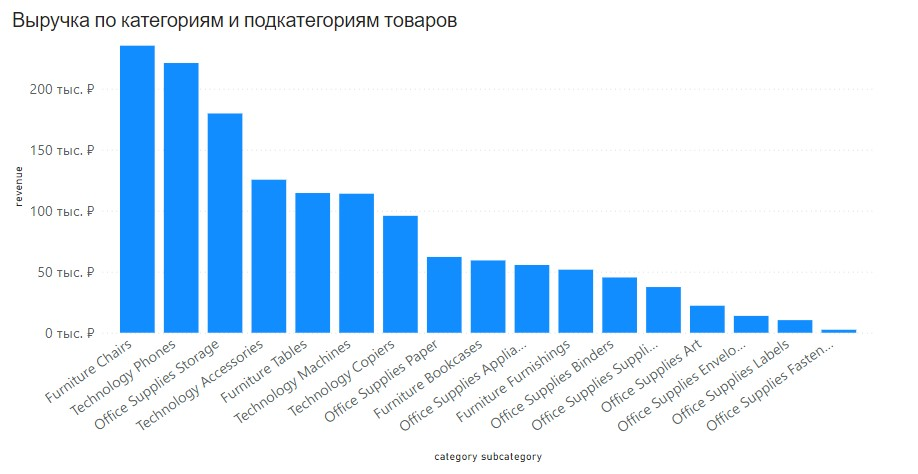
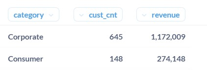
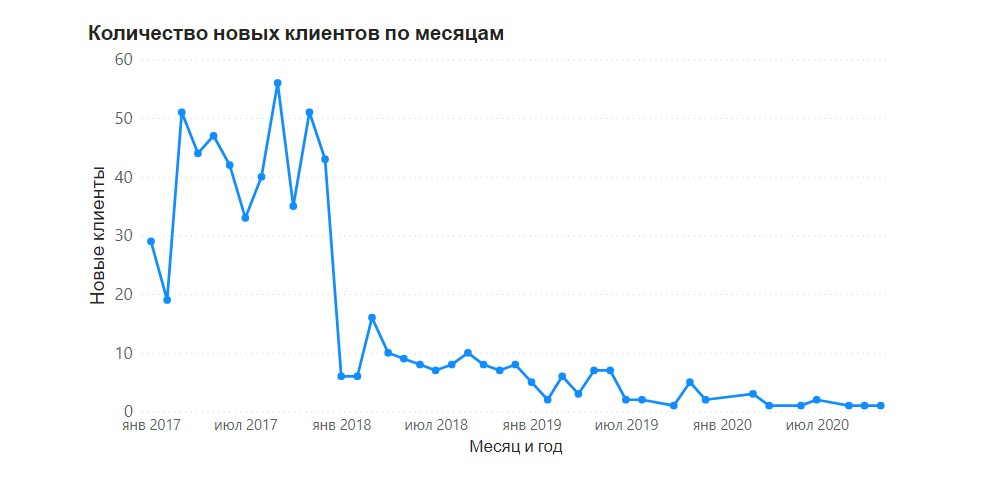
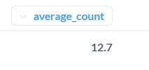
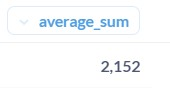
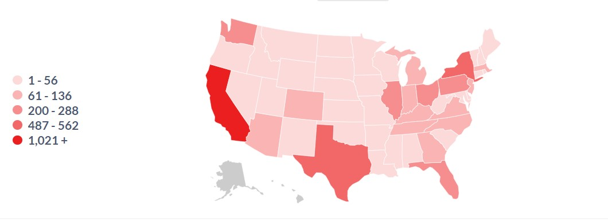

# Проект по SQL

## ЗАДАЧА

Проанализировать работу компании с точки зрения ее эффективности
Дать рекомендации по масштабированию бизнеса, а именно в каком штате лучше открыть офлайн-магазин

КОНКРЕТНЫЕ ШАГИ
1. Оценить динамику продаж и распределение выручки по товарам.
2.	Составить портрет клиента, а для этого — выяснить, какие клиенты приносят больше всего выручки.
3.	Проконтролировать логистику компании (определить, все ли заказы доставляются в срок и в каком штате лучше открыть офлайн-магазин)

## Шаг 1: Определяем эффективность продаж

Какова динамика продаж?

* Какие категории и подкатегории продаж приносят больше всего выручки?
* Какие товары продаются лучше всего?

### Считаем выручку

*	date (месяц заказа) ― тип date;
*	revenue (объем выручки) ― округленные значения до целых с помощью round.

Запрос:

```sql
select
date_trunc('month',sd.order_date)::date date, 
round(SUM(sp.price * sc.quantity * (1 - sc.discount))) revenue  
--Выручка = цена * кол-во * (1 - доля скидки)
from
sql.store_products sp
join sql.store_carts sc on sc.product_id = sp.product_id
join sql.store_delivery sd on sd.order_id = sc.order_id
group by 1
order by 1

```

### Динамика выручки по месяцам:




### Вывод:

По диаграмме отчетливо видно, что наблюдается сезонность


## Считаем выручку по категориям

Посмотрим, что клиенты покупают больше всего.

Запрос, который выведет сумму выручки по различным категориям и подкатегориям:

*	category (категория товара);
*	subcategory (подкатегория товара);
*	revenue (объем выручки) ― округлите до целых с помощью round.

Запрос:

```sql
select sp.category, sp.subcategory, round(SUM(sp.price * sc.quantity * (1 - sc.discount))) revenue
from
sql.store_products sp
join sql.store_carts sc on sc.product_id = sp.product_id
group by 1,2
order by 3 desc

```

Выручка по категориям и подкатегориям товаров:




## Смотрим на товары

Важно не только понять, какие из товаров приносят больше всего выручки, но и определить, какую долю от общей выручки составляют их продажи.
Запрос, который выведет данные топ-25 товаров по объёму выручки в следующем формате:

*	product_nm — наименование товара;
*	revenue — объем выручки;
*	quantity — количество проданных товаров;
*	percent_from_total — доля от общей выручки в процентах


Запрос:
```sql
select

sp.product_nm,
round(SUM(sp.price * sc.quantity * (1 - sc.discount)),2) revenue,
SUM(quantity) as quantity,

round(SUM(sp.price * sc.quantity * (1 - sc.discount)) / 
(
select SUM(sp.price * sc.quantity * (1 - sc.discount)) total_sum
from
sql.store_products sp join sql.store_carts sc on sc.product_id = sp.product_id
)*100,2
) as percent_from_total

from
sql.store_products sp join sql.store_carts sc on sc.product_id = sp.product_id
group by 1
order by 2 desc
limit 25

```

Комментарий к запросу:

```sql
select SUM(sp.price * sc.quantity * (1 - sc.discount)) total_sum
from
sql.store_products sp join sql.store_carts sc on sc.product_id = sp.product_id
```
Этот запрос вычисляет общую сумму выручки. Он используется при вычислении доли в списке столбцов


## Шаг 2: Составляем портрет клиента


Ответим на следующие вопросы:

*	Как соотносится количество клиентов по категориям B2B и B2C?
*	Как соотносится выручка по этим категориям?
*	Каких клиентов больше, новых или старых?


Рассчитаем основные показатели по целевым клиентам: 

*	количество заказов
*	средняя сумма заказов
*	количество различных адресов доставки

## Считаем выручку клиентов по категориям

Посмотрим, сколько у компании B2B и B2C-клиентов и какую долю от общей выручки они приносят.

Запрос, который выведет количество клиентов и выручку по категориям клиента:

*	category (категория клиента);
*	cust_cnt (количество клиентов);
*	revenue (объём выручки) ― округлите до целых с помощью round.

Запрос:

```sql
select
scu.category,
count(distinct scu.cust_id) cust_cnt,
round(SUM(sp.price * sc.quantity * (1 - sc.discount))) revenue
from
sql.store_customers scu
join sql.store_delivery sd on scu.cust_id = sd.cust_id
join sql.store_carts sc on sc.order_id = sd.order_id
join sql.store_products sp on sp.product_id = sc.product_id
group by scu.category
order by 3 desc

```

### Комментарий:
Необходимо указать ключевое слово distinct при подсчете количества клиентов

### Вывод:



## Составляем характеристику B2B-клиентов


Ответим на следующие вопросы:

*	Какова динамика новых B2B-клиентов по месяцам? 
*	С чем связан рост выручки: за счет увеличения продаж по старым клиентам или же за счёт привлечения новых клиентов?

Запрос, который выведет количество новых корпоративных клиентов по месяцам:
*	month (месяц) ― тип date;
*	new_custs (количество новых клиентов).

Запрос:

```sql
with cust_mindate as    --CTE для подсчёта дату первой покупки каждого клиента

(
select scu.cust_id, MIN(date_trunc('month',sd.order_date)::date) min_date
from
sql.store_customers scu join sql.store_delivery sd on scu.cust_id = sd.cust_id
where scu.category = 'Corporate'
group by 1
)

select min_date as month, count(cust_id) new_custs      -- Запрос подсчёта количества новых клиентов в каждый месяц
from cust_mindate
group by min_date
order by 1

```
По полученным данным построим график динамики новых корпоративных клиентов по месяцам



## Вывод:

Как видно из графика, в самом начале было привлечено много клиентов, а после 2018 года новые клиенты почти не привлекались.

## Составляем характеристику B2B-клиентов

Изучим основные показатели по корпоративным клиентам: 

Ответим на следующие вопросы:

*	Какова сумма заказа?
*	Сколько товаров в заказе и сколько различных офисов?
*	Куда они доставлялись?

Найдём ответы на следующие вопросы.
Все ответы округлены до одного знака после разделителя
 
### Сколько в среднем различных товаров в заказах у корпоративных клиентов?

Запрос:

```sql
with cust_countproduct as

(
select scu.cust_id, COUNT(sp.product_id) as countproduct
from
sql.store_customers scu join sql.store_delivery sd on scu.cust_id = sd.cust_id
join sql.store_carts sc on sd.order_id = sc.order_id
join sql.store_products sp on sp.product_id = sc.product_id
where scu.category = 'Corporate'
group by 1
)

select round(avg(countproduct),1) as average_count
from 
cust_countproduct

```

Результат:



### Какая в среднем сумма заказов у корпоративных клиентов?

Запрос:

```sql
with cust_revenue as

(
select scu.cust_id, SUM(sc.quantity * sp.price) as sum_revenue
from
sql.store_customers scu join sql.store_delivery sd on scu.cust_id = sd.cust_id
join sql.store_carts sc on sd.order_id = sc.order_id
join sql.store_products sp on sp.product_id = sc.product_id
where scu.category = 'Corporate'
group by 1
)

select round(avg(sum_revenue), 1) as average_sum
from cust_revenue

```

Результат:



**Сколько в среднем различных офисов у корпоративных клиентов?**

Запрос:

```sql
with cust_zipcode as

(
select scu.cust_id, COUNT(sd.zip_code) as sum_zipcode
from
sql.store_customers scu join sql.store_delivery sd on scu.cust_id = sd.cust_id
where scu.category = 'Corporate'
group by 1
)

select avg(sum_zipcode)
from
cust_zipcode

```


## Шаг 3: Анализируем логистику компании

Оценим текущую картину по логистике поставок и найдём штат, в котором лучше всего открыть офлайн-магазин.

Сформулируем вопросы, на которые нам предстоит найти ответы в рамках задачи:
*	Насколько эффективно выполняются текущие доставки?
*	Как распределяются доставки и выручка по штатам и городам? (Ответ на этот вопрос поможет определить наиболее удачное место для офлайн-магазина.)


## Определяем эффективность доставки

Определим, какая доля заказов выполняется в срок по каждой категории.

Запрос, который выведет:
*	тип доставки;
*	общее количество заказов (orders_cnt);
*	количество заказов, которые не были доставлены вовремя (late_orders_cnt);
*	долю выполненных вовремя заказов, в процентах (% success), округленную до двух знаков после запятой.


Запрос:

```sql
with is_ontime as       --CTE показывает, вовремя или нет был доставлен каждый заказ каждого типа 
(
select sd.ship_mode,
case
when sd.ship_mode = 'Standard Class' and (sd.ship_date - sd.order_date <= 6) then 'yes'
when sd.ship_mode = 'Second Class' and (sd.ship_date - sd.order_date <= 4) then 'yes'
when sd.ship_mode = 'First Class' and (sd.ship_date - sd.order_date <= 3) then 'yes'
when sd.ship_mode = 'Same Day' and (sd.ship_date - sd.order_date <= 0) then 'yes'
else 'no'
end as status
from sql.store_delivery sd
),

table_success as        --CTE показывает количество вовремя доставленных заказов каждого типа
(
select ship_mode, COUNT(status) count_success
from is_ontime
where status = 'yes'
group by 1
),

table_notsuccess as     --CTE показывает количество заказов каждого типа, доставленных с опозданием
(
select ship_mode, COUNT(status) count_notsuccess
from is_ontime
where status = 'no'
group by 1
),

count_orders as     --CTE показывает количество заказов каждого типа
(
select sd.ship_mode, COUNT(sd.order_id) orders_cnt
from sql.store_delivery sd
group by 1
)

select co.ship_mode, orders_cnt, count_notsuccess late_orders_cnt, round(count_success::numeric/orders_cnt * 100,2) as "% success"
from count_orders co
join table_success ts on ts.ship_mode = co.ship_mode
join table_notsuccess tn on tn.ship_mode = ts.ship_mode
order by 4

```

 **Определим долю заказов, отправленных вторым классом, которые были доставлены с опозданием, по кварталам и построим график**  
 
Запрос:

```sql
with is_ontime_2ndclass as  -- CTE выводит статус, вовремя или нет была осуществлена доставка вторым классом по кварталам
(
select sd.ship_mode, date_trunc('quarter', sd.ship_date)::date as "quarter_date",
case
when sd.ship_mode = 'Second Class' and (sd.ship_date - sd.order_date <= 4) then 'yes'
else 'no'
end as status
from sql.store_delivery sd
where sd.ship_mode = 'Second Class'
),

table_notsuccess_2ndclass as    -- CTE: количество не вовремя доставленных заказов второго класса по кварталам
(
select ship_mode, quarter_date, COUNT(status) count_notsuccess_2ndclass
from is_ontime_2ndclass
where status = 'no'
group by 1,2
order by 2
),

count_orders_2ndclass as        -- Количество заказов второго класса
(
select sd.ship_mode, COUNT(sd.order_id) orders_cnt_2ndclass
from sql.store_delivery sd
where sd.ship_mode = 'Second Class'
group by 1
)

select quarter_date, round(count_notsuccess_2ndclass::numeric/ orders_cnt_2ndclass * 100, 2) as "% not_success"
from table_notsuccess_2ndclass tn join count_orders_2ndclass co on tn.ship_mode = co.ship_mode

```
### Доля заказов второго класса, отправленных с опозданием по кварталам


## Вывод:

Заказы доставляются с опозданием  в течение ограниченного периода времени.

## Выбираем оффлайн точку продаж

С помощью оффлайн-магазина можно привлечь больше клиентов и снизить стоимость доставки, нужно только выбрать, где его открыть.

Напишем запрос, который выведет количество доставок по штатам.

```sql
select state, COUNT(sd.order_id)
from
sql.store_delivery sd
group by 1
order by 2 desc

```



## Вывод:

Исходя из данной карты распределения количества доставок по штатам можно сделать вывод, что штат Калифорния является наиболее подходящим для размещения 
